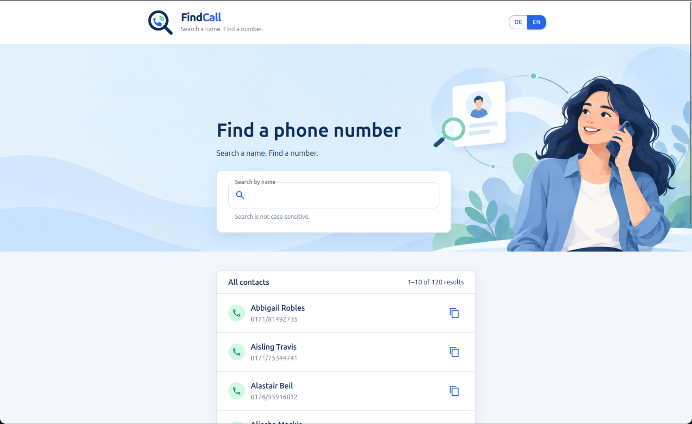
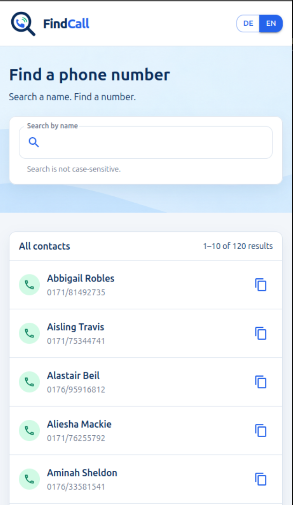
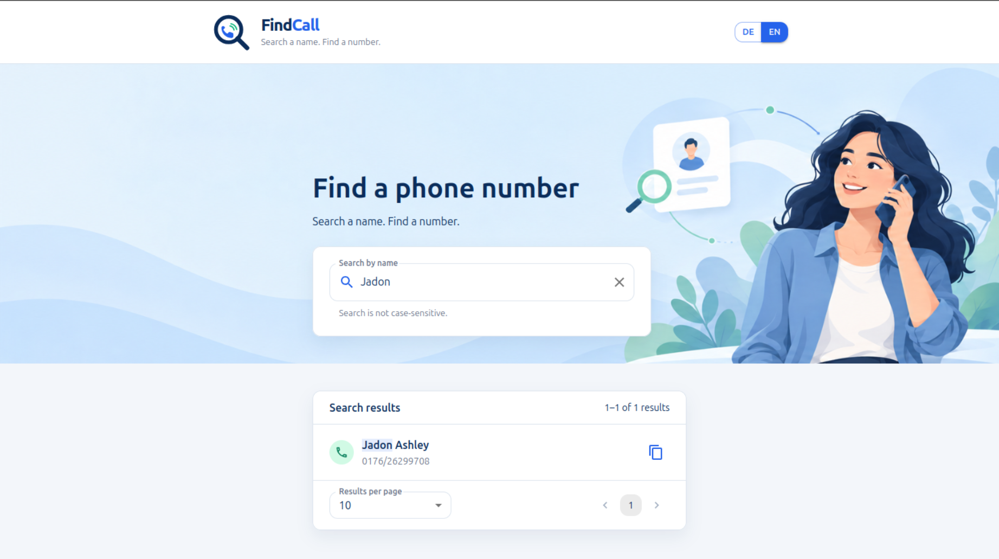

# FindCall

[](https://github.com/JonasGreim/phonebook-challenge/actions/workflows/quality.yml)

<p align="center">
  
</p>

FindCall is a bilingual German/English phonebook search website. Search by contact name,
review paginated results, and copy a phone number with accessible feedback.

**[Open the live demo](https://findcall.onrender.com/)**

## Live demo

FindCall is deployed on Render's free tier as two separate services: a static frontend and a
GraphQL backend. The backend may sleep after inactivity, so the first request can take up to
approximately one minute while it wakes up. Subsequent requests run normally.

## Screenshots

The phonebook and the contact details shown in these screenshots are sample/demo data for this
coding challenge. The screenshots show the complete product experience, including directory and
search results:



*Desktop directory view with the responsive Hero, bilingual switch, and paginated contacts.*



*Compact mobile directory view with the same search experience and responsive result rows.*



*Filtered search with a matching contact, result count, page-size selector, and pagination.*

## Features

- German and English interface with persisted language selection.
- Case-insensitive, name-based phonebook search through GraphQL.
- Alphabetically sorted initial directory view and filtered search results.
- Server-side pagination with 10, 25, or 50 results per page.
- Copy-to-clipboard actions with translated success and failure feedback.
- Responsive full-width Hero with desktop, tablet, and mobile compositions.
- Keyboard-accessible controls, labels, focus states, and pagination.
- Loading, delayed-service, error, and no-results states.

## Technology

- React
- TypeScript
- Material UI
- GraphQL and Apollo Server
- Vite
- Node.js
- GitHub Actions
- Render

## Local setup

Requires Node.js 22.22.2 or later and npm 10 or later.

Install dependencies:

```bash
npm ci
```

For the simplest local development setup, run the frontend and GraphQL server together:

```bash
npm run dev
```

The frontend is available at `http://localhost:5173`; the GraphQL server listens on
`http://localhost:4000`.

To run the services separately, start the server in one terminal:

```bash
npm run start:server
```

Then run the Vite client in a second terminal:

```bash
npm run dev:client
```

In development, the client uses its existing `VITE_GRAPHQL_URL` fallback to connect to
`http://localhost:4000/`. No second local configuration mechanism is required. Production
deployments provide `VITE_GRAPHQL_URL` as the public backend URL at build time.

## Quality checks

```bash
npm run check
```

This runs the configured TypeScript typecheck, ESLint, Prettier formatting check, Vitest suite,
and Vite production build.

## Deployment

1. Create a feature branch for your changes.
2. Push the branch and open a pull request against `main`.
3. GitHub Actions runs the configured quality checks for the pull request.
4. Merge the pull request after the checks pass.
5. Render detects the new `main` commit and deploys the frontend and GraphQL backend after the CI
   checks pass.

The deployment is defined in
[`render.yaml`](https://github.com/JonasGreim/phonebook-challenge/blob/main/render.yaml). The
frontend and backend are deployed as separate Render services. Because the backend uses Render's
free tier, the first request after inactivity may take up to approximately one minute while the
service wakes up.

## Project structure

- [`src/`](src/) – React frontend, components, hooks, translations, and tests.
- [`server/`](server/) – Apollo GraphQL backend and server-side data loading.
- [`docs/`](docs/) – requirements, architecture, UI/UX documentation, and screenshots.
- [`.github/`](.github/) – GitHub Actions quality workflow.
- [`render.yaml`](render.yaml) – Render Blueprint configuration.

The phonebook source remains server-only in `server/data/telefonbuch.json`; it is never imported
by the client. The included contact records are sample data and are not intended as real
production directory information.
